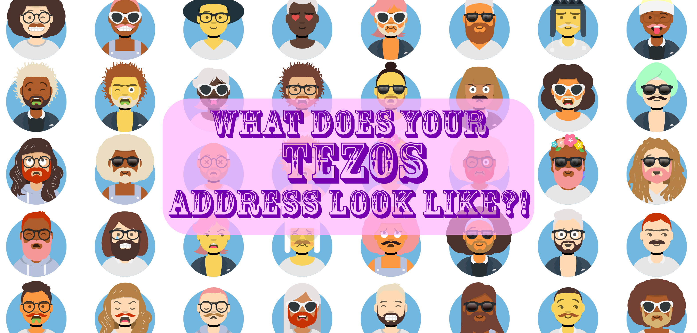

# tezface
Connect your tezos wallet and finally see what your tez account looks like. [Demo here.](http://defi.piza/tezface)

This whole thing is a combo of beacon connect + a-avataaar, a simplified version of avataaar, an open-source avatar generator imagined up by poopoo.tez and rainbowuunicorn.tez.
